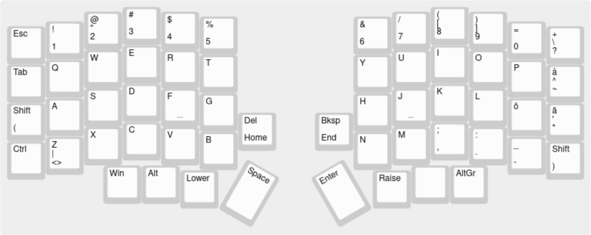

# Default layer

# Lower layer

# Raise layer

Make example for this keyboard (after setting up your build environment):

    make lily58/r2g:elf

Flash example for this keyboard:

    make lily58/r2g:elf:flash